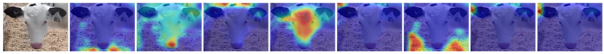
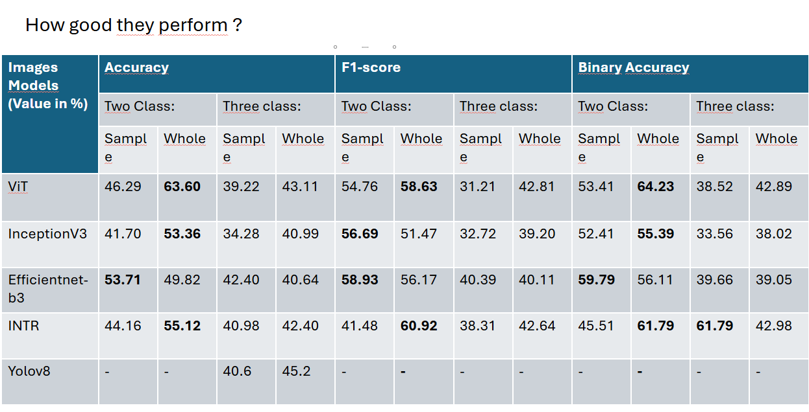
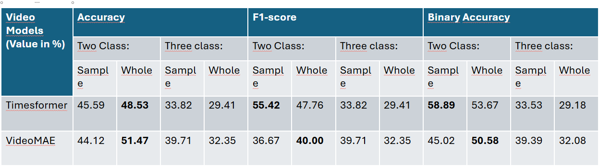
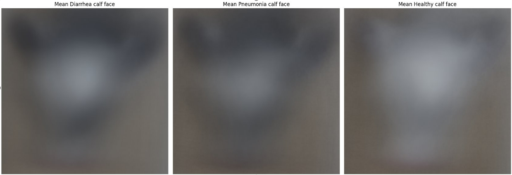

## About 
This repository contains the code for my work as intern at PaquetLab at ULaval. 
I worked on detecting the calf's health status using deep learning models. The calf's health status is either "healthy", "diarrhea" or "pneumonia".
The goal was to detect the calf's health status using the video/images of calf approaching the feeder and if possible, to explain the model's decision.

## Datasets
I generate the dataset by extracting images and videos of calves approaching the feeder. The dataset contains images and videos of calves 10s before the beginning of their visit to the feeder. You can find more details on the pdf reports mentioned below.
To make it short, I finetuned YoloV8 on detecting calf's face and used it to extract the images and videos. So the dataset is also noisy, with some garbage data that need to be clean. You can find an exemple of image [here](readme/calf.png).

I have to mentioned that I used YoloV8 to also get the bbox of the calf's face, but I didn't use it to detect the calf's health status (only later). So most of my work, particularly images models, is based on the images of the calf's face.

## Models
I trained several models to detect the calf's health status, including: 

- For images: DeepLabV3, EfficientNet, InceptionV3, Unet(finally, abandoned), ViT and LSTM+CNN(I started but didn't finish)
- For videos: TimeSformer, ViViT and VideoMAE

I also finetuned INTR model to interpret the model's decision, and you can find my work on the [INTR model here](https://github.com/amenalahassa/intr-paquetlab). You can see an example of the model's decision in the image above.
Not perfect as in the paper 😅, still work to do.

## Results
I finally evaluated the models on the same dataset and compared their performance. Their still work to do but you can find a report of the results in the pdf files under the readme folder.

I also write a post about this project on my [blog](#). You can find more details about the project and what I think about it.
I didn't have the time to finish the project, but I'm happy with the results I got. I think their still work to do to improve the models' performance and to make them more interpretable.
Hopefully, If I have the time, I will continue to work on this project and update with a new post on my blog.

## Next 
I think the next step is
- to improve the models' performance: find better data augmentation techniques by example,
- better evaluate the models, but with a more robust evaluation set, and add confusion matrix by example,
- finish the LSTM+CNN model, I think it has potential,
- the dataset still contains some garbage data, find a way to clean it, 
- and any other ideas that come to your mind and that can improve the project :)

For fun, bellow is the mean calf face on whole set I used on my latest training of the model I mentioned above.

## License
This project is licensed under the MIT License. 